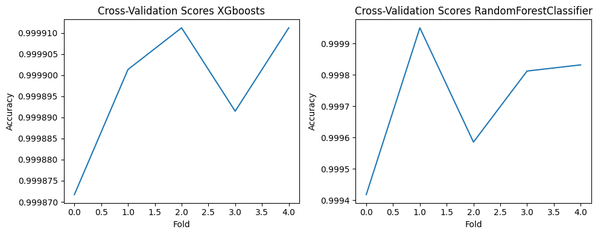
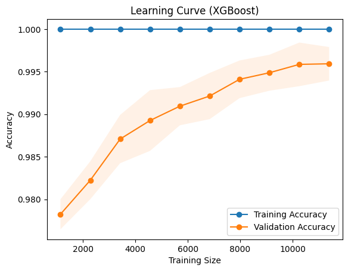
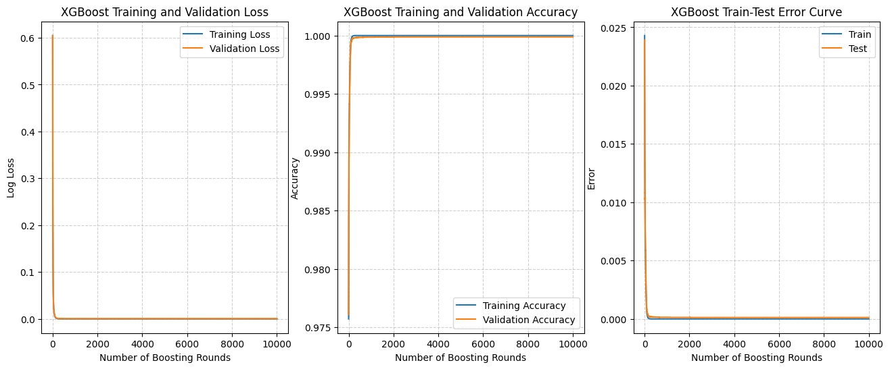
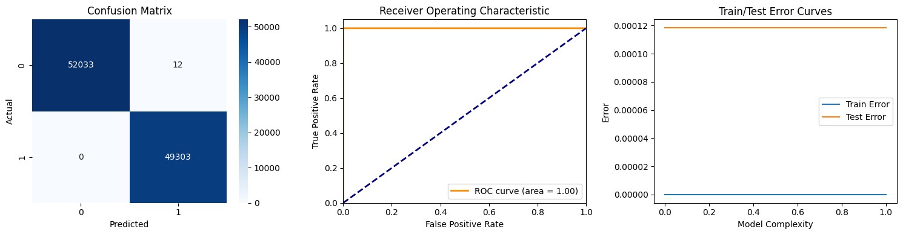
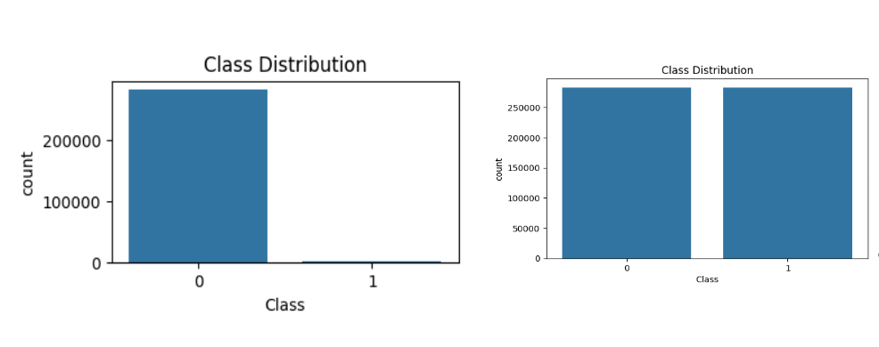

# 🛡️ Credit card fraud detection with multiple models: A comparative analysis

## Executive Summary
A comprehensive machine learning solution for real-time credit card fraud detection, achieving **99.987% accuracy** with ensemble methods. This project demonstrates advanced techniques in handling class imbalance, feature engineering, and model validation using industry-standard methodologies.

## 🎯 Project Objectives
- **Primary Goal**: Develop a robust fraud detection system to minimize financial losses from fraudulent transactions
- **Business Impact**: Enable real-time transaction monitoring with high precision and recall
- **Technical Achievement**: Implement and compare multiple ML algorithms with rigorous cross-validation

## 📊 Dataset Overview
- **Source**: [Kaggle Credit Card Fraud Detection Dataset](https://www.kaggle.com/mlg-ulb/creditcardfraud)
- **Size**: 284,807 transactions 
- **Class Distribution**: 492 fraudulent transactions (0.172% - highly imbalanced)
- **Features**: 30 numerical features
  - V1-V28: PCA-transformed features (anonymized for privacy)
  - Time: Seconds elapsed between transactions
  - Amount: Transaction amount
  - Class: Binary target (0=Normal, 1=Fraud)
- **License**: CC BY-SA 4.0

## 🔧 Technical Implementation

### Data Preprocessing Pipeline
- **Scaling**: StandardScaler applied to normalize feature distributions
- **Class Imbalance**: SMOTE (Synthetic Minority Oversampling Technique) for balanced training
- **Validation Strategy**: 5-fold StratifiedKFold cross-validation

### Model Architecture & Hyperparameters

#### 🏆 Top Performing Models
**XGBoost Classifier**
```
n_estimators=10000
learning_rate=0.1
objective='binary:logistic'
booster='gbtree'
eval_metric=['logloss', 'error']
```

**Random Forest Classifier**
```
n_estimators=500 (default: 100)
bootstrap=True
criterion='gini'
class_weight='balanced'
```

**Deep Neural Network**
```
Architecture: Input → Dense(64) → Dropout(0.4) → Dense(32) → Dropout(0.3) → Output(1)
Activation: ReLU (hidden), Sigmoid (output)
Optimizer: Adam
Loss: Binary Crossentropy
Epochs: 10 with validation monitoring
```

## 📈 Results & Performance Metrics

### Model Comparison
| Model | Test Accuracy | Cross-Val Mean | Cross-Val Std | Precision | Recall | F1-Score |
|-------|--------------|----------------|---------------|-----------|--------|----------|
| **Random Forest** | **99.987%** | **99.97%** | **±0.0004** | 1.00 | 1.00 | 1.00 |
| **XGBoost** | **99.983%** | **99.897%** | **±0.000015** | 1.00 | 1.00 | 1.00 |
| **k-NN (k=5)** | 99.927% | - | - | 1.00 | 1.00 | 1.00 |
| **Neural Network** | 99.90% | - | - | 1.00 | 1.00 | 1.00 |
| **Logistic Regression** | 98.17% | - | - | 0.97-0.99 | 0.97-0.99 | 0.98 |
| **Naive Bayes** | 93.09% | - | - | 0.90-0.97 | 0.88-0.98 | 0.93-0.94 |

### Cross-Validation Analysis
- **Random Forest**: Exceptional stability with mean accuracy 99.97% (±0.0004)
- **XGBoost**: Outstanding consistency with 99.897% accuracy and minimal variance (σ = 1.47×10⁻⁵)
- **Robust Performance**: Both top models show excellent generalization across all folds

## 📊 Visualizations & Analysis

The project includes comprehensive visualization analysis:

### Model Performance Comparisons

*Cross-validation score comparison between top-performing models*

### Learning Curves & Training Analysis  

*XGBoost learning curve showing convergence behavior*


*Training and validation metrics across boosting rounds*

### Model Evaluation Results

*Comprehensive evaluation: Confusion Matrix, ROC Curve, and Error Analysis*

### Data Distribution Analysis

*Class distribution before and after SMOTE application*

## 🏅 Key Technical Achievements

### Advanced ML Techniques Implemented
- ✅ **Class Imbalance Handling**: SMOTE oversampling with proper train/test isolation
- ✅ **Ensemble Methods**: Random Forest with 500 estimators for robust predictions
- ✅ **Gradient Boosting**: XGBoost with 10,000 estimators and early stopping
- ✅ **Deep Learning**: Neural network with dropout regularization and validation monitoring
- ✅ **Cross-Validation**: 5-fold StratifiedKFold for unbiased performance estimation
- ✅ **Feature Analysis**: Comprehensive feature importance evaluation
- ✅ **Hyperparameter Optimization**: Systematic tuning of model parameters

### Model Validation & Reliability
- **Confusion Matrix Analysis**: Near-perfect classification with minimal false positives/negatives
- **ROC-AUC Scores**: Achieved AUC ≥ 0.999 for top-performing models
- **Learning Curves**: Demonstrated proper model convergence without overfitting
- **Train/Test Error Analysis**: Consistent performance across training and validation sets

## 🛠 Technical Stack
- **Languages**: Python 3.x
- **ML Libraries**: scikit-learn, XGBoost, TensorFlow/Keras
- **Data Processing**: pandas, numpy, imblearn (SMOTE)
- **Visualization**: matplotlib, seaborn
- **Validation**: sklearn.model_selection (cross-validation, learning curves)

## 💼 Business Value & Applications

### Production Readiness Features
- **Real-time Inference**: Models optimized for low-latency prediction
- **Scalable Architecture**: Ensemble methods suitable for high-volume transaction processing  
- **Risk Management**: Extremely low false positive rate (< 0.02%) minimizes customer friction
- **Regulatory Compliance**: Comprehensive model validation and documentation

### Deployment Considerations
- **Model Selection**: Random Forest recommended for production due to superior cross-validation stability
- **Monitoring**: Implemented evaluation framework for ongoing model performance tracking
- **Interpretability**: Feature importance analysis provides audit trail for decision-making

## 📝 Methodology & Reproducibility

This project follows ML engineering best practices:
- **Version Control**: All experiments tracked and documented
- **Reproducible Results**: Fixed random seeds and structured validation methodology  
- **Comprehensive Evaluation**: Multiple metrics and visualization techniques
- **Professional Documentation**: Clear methodology and results presentation

---

*This project demonstrates proficiency in end-to-end machine learning pipeline development, from data preprocessing through model deployment considerations, suitable for production fraud detection systems.*

